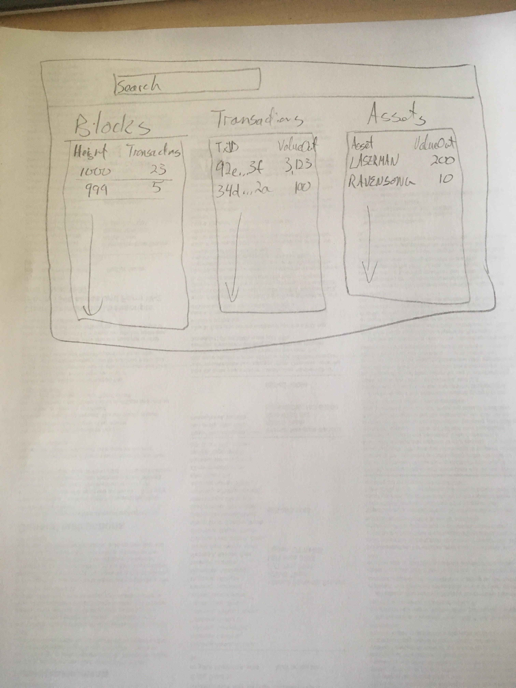
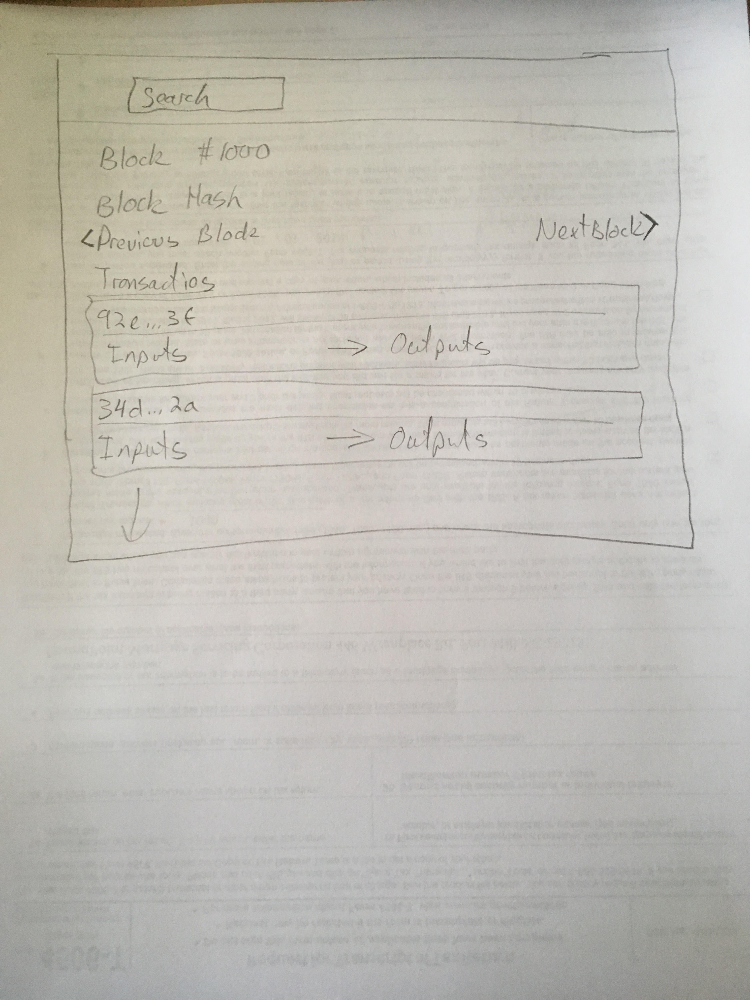
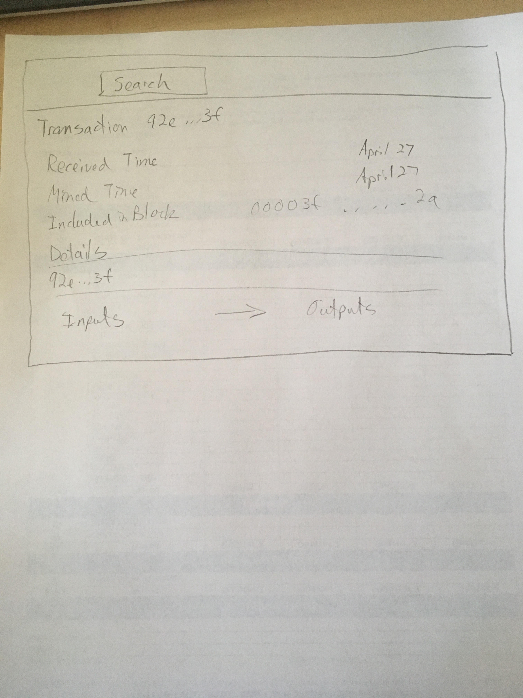
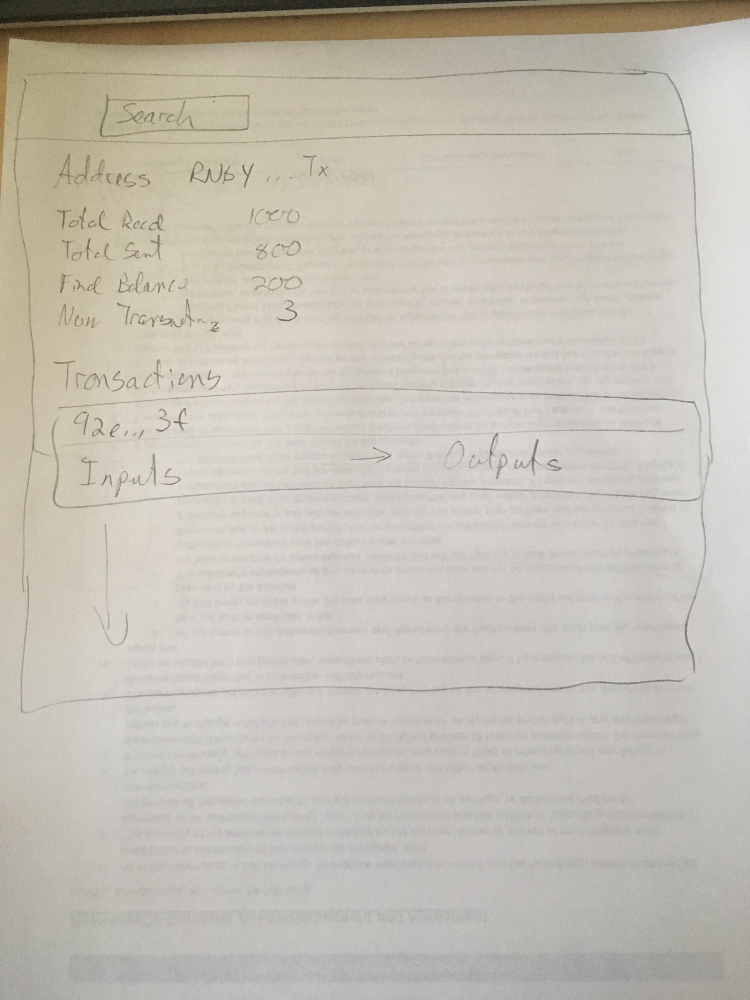
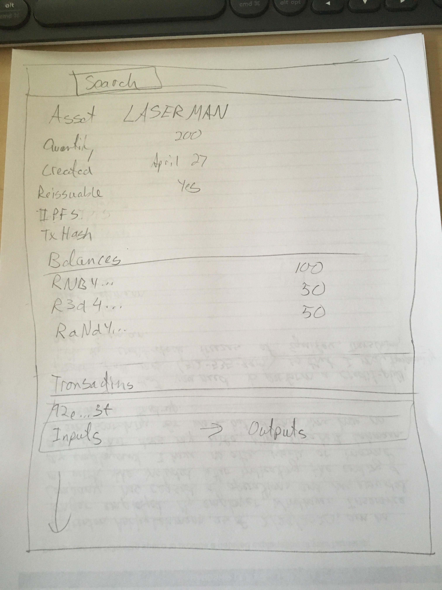
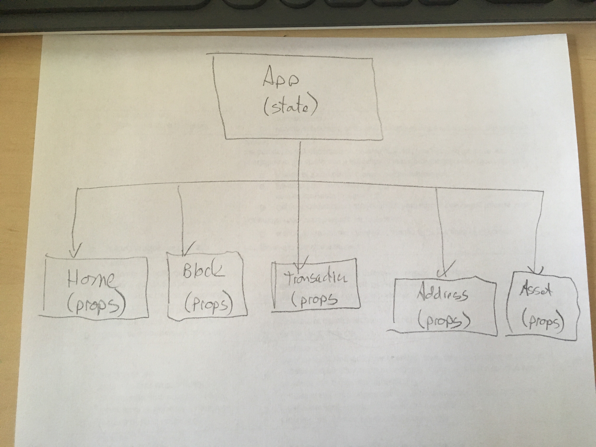

## Project Description

My project will be a block explorer for the Ravencoin cryptocurrency.  

The website will have two main displays of data. The first will be recent information such as blocks, coin transactions, and asset transactions.

The second display type will key off of an input and can show searches by:

- block number
- transaction hash
- address
- asset name

## Wireframes

Home / Landing Page



Block



Transaction



Address



Asset



## MVP User Stories

As a user, I want to see a list of the most recent blocks (time, block hash, transaction count) on the RVN blockchain
As a user, I want to see a list of the most recent transactions (coin and asset) on the RVN blockchain
As a user, I want to be able to click on any of the listed blocks or transactions and see the data behind them, including source transactions and addresses and destination addresses.
As a user, I want to be able to search for blocks, transactions, addresses, or assets that interest me and see a full history of activity relating to my search.

## Post MVP Stretch Goals

As a user, I can view the explorer website on my phone.
As a user, I can see a tree of transactional history showing all source transactions and address that result in an addresses current balance of RVN or an asset.
As a user, I can create a private key and a corresponding RVN address in order to send and receive RVN or assets via the website.  This functionality will include the use of localStorage to persist the private keys and will also have the private keys encrypted and only unlockable with a passphrase determined by the user.

## API

### API documentation

https://github.com/RavenDevKit/insight-api

The API is deployed by me at https://ravenexplorer.net. It is not open to the world but will be available to whatever site is hosting my final project.  Some examples of API implemented at ravenexplorer.net:

by block height: https://ravenexplorer.net/api/block-index/0

```
{"blockHash":"0000006b444bc2f2ffe627be9d9e7e7a0730000870ef6eb6da46c8eae389df90"}
```

by block hash: https://ravenexplorer.net/api/block/0000006b444bc2f2ffe627be9d9e7e7a0730000870ef6eb6da46c8eae389df90

```
{
  "hash": "0000006b444bc2f2ffe627be9d9e7e7a0730000870ef6eb6da46c8eae389df90",
  "size": 295,
  "height": 0,
  "version": 4,
  "merkleroot": "28ff00a867739a352523808d301f504bc4547699398d70faf2266a8bae5f3516",
  "tx": [
    "28ff00a867739a352523808d301f504bc4547699398d70faf2266a8bae5f3516"
  ],
  "time": 1514999494,
  "nonce": 25023712,
  "bits": "1e00ffff",
  "difficulty": 3906.25,
  "chainwork": "0000000000000000000000000000000000000000000000000000000001000100",
  "confirmations": 1206448,
  "previousblockhash": null,
  "nextblockhash": "00000058bcc33dea08b53691edb9e49a9eb8bac36a0db17eb5a7588860b1f590",
  "reward": 5000,
  "isMainChain": true,
  "poolInfo": {}
}
```

by transaction hash: https://ravenexplorer.net/api/tx/603da1e1603563658e69b572a7a36c6ca0874c75365c38082fb34853a5368d12

```
{
  "txid": "603da1e1603563658e69b572a7a36c6ca0874c75365c38082fb34853a5368d12",
  "version": 2,
  "locktime": 1206441,
  "vin": [
    {
      "txid": "fea5261499b3f530c46c858f38f1e078d54f500e4f7261fa3b4afe8cc21bb8d7",
      "vout": 0,
      "sequence": 4294967294,
      "n": 0,
      "scriptSig": {
        "hex": "473044022072caa2452ce708eb0c05b0454cac47f163f0f4805cf2863874936268f15d41670220660997ad2d3c9f8729c4336ab0075f92b915edb54395f0e4eb3243510ad1d353012102c6a62178ff3086dfe2c5de0d1e007fa0c27f7cfd6c1daa985c44879fdf9506e3",
        "asm": "3044022072caa2452ce708eb0c05b0454cac47f163f0f4805cf2863874936268f15d41670220660997ad2d3c9f8729c4336ab0075f92b915edb54395f0e4eb3243510ad1d353[ALL] 02c6a62178ff3086dfe2c5de0d1e007fa0c27f7cfd6c1daa985c44879fdf9506e3"
      },
      "addr": "RChQuyr5eXpbhwSJsy5oNJ5e9qkkx7qtWt",
      "valueSat": 6908298595,
      "value": 69.08298595,
      "doubleSpentTxID": null
    }
  ],
  "vout": [
    {
      "value": "6.71516066",
      "n": 0,
      "scriptPubKey": {
        "hex": "76a914c9fe525de796e52d2f436fb0673b4532f231501388ac",
        "asm": "OP_DUP OP_HASH160 c9fe525de796e52d2f436fb0673b4532f2315013 OP_EQUALVERIFY OP_CHECKSIG",
        "addresses": [
          "RThEZf9tWAGeAVTuarcAUHGw3tYuMGNkcu"
        ],
        "type": "pubkeyhash"
      },
      "spentTxId": "766d589c631bb3eec4bfedf0a71b93db63cb5a6ea8945ab1a822da3fbc75f5b8",
      "spentIndex": 0,
      "spentHeight": 1206445
    },
    {
      "value": "62.36528444",
      "n": 1,
      "scriptPubKey": {
        "hex": "76a9141683d572b2c08ec70c059d6c8b9d222b1ca370f388ac",
        "asm": "OP_DUP OP_HASH160 1683d572b2c08ec70c059d6c8b9d222b1ca370f3 OP_EQUALVERIFY OP_CHECKSIG",
        "addresses": [
          "RBLEsi28TcejqYwqBs9UxVofDHRXb2Pzq4"
        ],
        "type": "pubkeyhash"
      },
      "spentTxId": "f255eb0aec84884651ac03b066bf7771d754c065e794bd6e1e7160c257332aff",
      "spentIndex": 0,
      "spentHeight": 1206445
    }
  ],
  "blockhash": "0000000000001fba55d3d036c190259a0317a3eac1c9fee4898d694461562a1c",
  "blockheight": 1206443,
  "confirmations": 7,
  "time": 1587985515,
  "blocktime": 1587985515,
  "valueOut": 69.0804451,
  "size": 225,
  "valueIn": 69.08298595,
  "fees": 0.00254085
}
```

by asset: https://ravenexplorer.net/api/assets?asset=LASERMAN&verbose=true

```{
  "LASERMAN": {
    "name": "LASERMAN",
    "amount": 200,
    "units": 0,
    "reissuable": 1,
    "has_ipfs": 0,
    "block_height": 755786,
    "blockhash": "0000000000000bc2023b1867272f0bfc40832b22a05c326fcc972a0b2fbdb216"
  }
}
```

# Component Hierarchy

This program will be coded using React and React Router



Components

App: State	


Header: This will have the search bar and some general info like current block height - Props

Home: This will be the landing page that shows latest blocks and transactions - Props /

Block: This will show block summary data and the list of transactions contained - Props /block/:hash

Transaction: This will show transaction summary data and the list of inputs and outputs - Props /transaction/:txid

Address: This will show transaction history into and out of the address - Props /address/:address

Asset: This will show transaction history for the asset - Props /asset/:assetname


